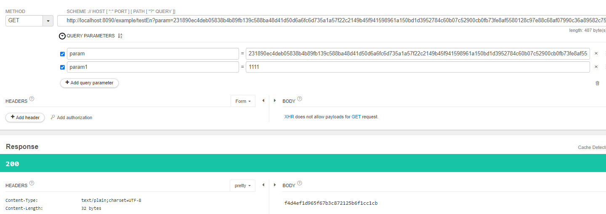
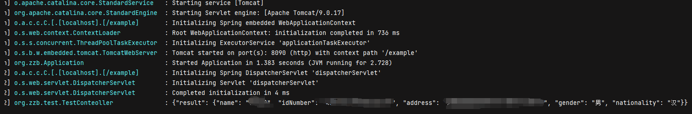

## zzb-secret-adapter 组件
> zzb-secret-adapter 宗旨是打造一个支持多算法、多形式（常规单应用，网关应用（zuul/gateway））的一个简单易用而又灵活的加解密组件

### 目前已实现功能

1.支持sm2、rsa、aes等算法进行加解密，并支持用户自定义算法进行加解密
2.支持用户自定义当前接口是否需要加解密，方便用户适应新老接口
3.支持@RequestParam、@RequestBody、@PathVariable等参数解析
4.实现单体应用、网关应用（zuul）的参数加解密

### 待实现功能
1.忽略特殊请求，如文件上传与下载
2.form-data形式加解密
3.只针对配置的参数进行加解密，例如只针对返回的data字段加密

### 配置
启动类上添加注解
@EnableParamSecurity

``` properties
# 应用类型，comm 通用应用、zuul统一网关、gateway网关（待实现） 
zzb.secure.type=comm 
# 加解密算法 支持 aes/sm2/rsa 和自定义
zzb.secure.algorithm.algorithm-name=aes
#  对称加密算法秘钥
zzb.secure.algorithm.key=qabAXTk9Z1akNjkQ
# 非对称加密算法私钥
zzb.secure.algorithm.private-key=d0efc0377a7f7f0e106c0c4c5d26678c685f400ab0a9970220952868fc426b38
# 非对称加密算法公钥
zzb.secure.algorithm.public-key=049eea820a4850372c558f4ab0d58dd598cdd0fab2bbd12dcfa932da92fa692dfd1f9be65d6d0a2e5ac4470130b473e6e1b34fa6aee57b9bb1b08f6c2da7a14c9a
# 模式 all 全局启用、support （默认）打了注解才进行加解密、single 单方向启用，需要配合leaf.secure.direction 启用
zzb.secure.model=support
# 启用方向 all 入方向解密，出方向加密、request 入方向解密、response 出方向加密
zzb.secure.direction=all
# 请求头校验，只针对带了自定请求头的才进行加解密
zzb.secure.header-flag=zzb
# 白名单，不进行加解密的请求路径
zzb.secure.white-urls[0]=/testEn
```

### 使用示例
``` java
  
    @PostMapping("testEn")
    @DecryptBody
    @EncryptBody
    public String testEn(@RequestBody Map<String, Object> map) {
        log.debug(map.toString());
        return "success";
    }

    @PostMapping("testEn/{param}")
    @DecryptBody
    public String testEn(@DecryptPathVariable String param) {
        log.debug(param);
        return "success";
    }

    @GetMapping("testEn")
    public String testEn(@DecryptParam  String param, @RequestParam String param1) {
        log.debug(param);
        return "success";
    }

    @GetMapping("testEnDTO")
    public String testEnDTO(@DecryptParam UserDTO userDTO) {
        log.debug(userDTO.toString());
        return "success";
    }
```




### Q&A
1.RequestParam部分参数需要解密，部分参数不需要
在需要解密的参数上打上 DecryptParam 注解，不需要加密的参数仍然使用 RequestParam 注解
如果参数名字有与实际参数名不同则配置 DecryptParam 的value 属性

2.如何开启网关配置
启用配置 zzb.secure.type=zuul 即可

3.如何使用自定义的加解密算法
实现接口 AlgorithmType 中的加解密方法， 并将该类加入spring 容器中，不需要配置BeanName,使用默认BeanName
例如 XxxAlgorithm 实现了 AlgorithmType，则配置 如下 
开启配置 zzb.secure.algorithm.algorithm-name=xxx

4.前端如何进行加解密
如果是vue,可使用axios 中的请求拦截器进行加密，响应拦截器进行解密
其他前端框架类似

